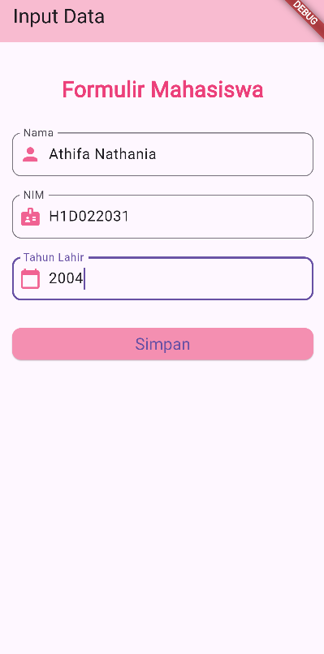
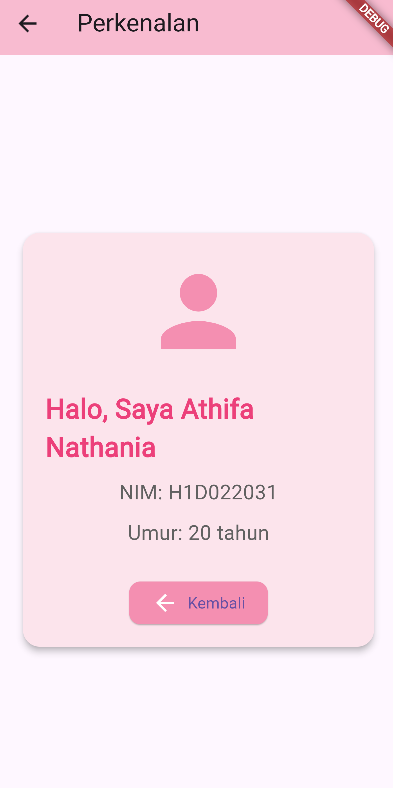

# Tugas Pertemuan 2

**Nama**  : Athifa Nathania  
**NIM**   : H1D022031  
**Shift** : F


## Proses Passing Data dari Form ke Tampilan Hasil pada Flutter
Pada aplikasi ini, data yang dimasukkan oleh pengguna melalui form input di halaman pertama akan diteruskan ke halaman kedua, di mana hasilnya akan ditampilkan. Aplikasi ini menggunakan Flutter, dengan fokus pada pengambilan data dari form, memprosesnya, lalu menampilkan data tersebut di layar lain menggunakan Navigator untuk melakukan navigasi antar halaman sekaligus melakukan passing data.

### 1. Input Data di Halaman Form (`form_data.dart`)
Di halaman form (`FormData`), pengguna dapat mengisi beberapa input seperti **Nama**, **NIM**, dan **Tahun Lahir** melalui widget `TextField`. Masing-masing input ini dikontrol oleh `TextEditingController`, yang memungkinkan kita untuk mengambil nilai yang dimasukkan pengguna ketika tombol simpan ditekan.

#### a. Membuat Controller untuk Input Form
Setiap input dalam form dikontrol oleh objek `TextEditingController` yang digunakan untuk mengambil teks yang dimasukkan oleh pengguna di dalam `TextField`.
```dart
final _namaController = TextEditingController();
final _nimController = TextEditingController();
final _tahunController = TextEditingController();
```
- `TextEditingController` akan menyimpan data dari TextField selama aplikasi berjalan.
- Ketika tombol simpan ditekan, kita akan menggunakan nilai dari controller ini untuk meneruskan data ke halaman berikutnya.

#### b. Menampilkan Input Form di Halaman
Pada halaman ini, `TextField` digunakan untuk mengambil input dari pengguna. Setiap `TextField` dikaitkan dengan controller yang sesuai (misalnya, `namaController` untuk input nama).
```dart
TextField(
  controller: _namaController,
  decoration: InputDecoration(
    labelText: "Nama",
    border: OutlineInputBorder(
      borderRadius: BorderRadius.circular(10),
    ),
    prefixIcon: Icon(Icons.person, color: Colors.pink[300]),
  ),
)
```
Demikian juga untuk input NIM dan Tahun Lahir, menggunakan controller masing-masing. Penggunaan controller ini memastikan bahwa setiap nilai yang dimasukkan pengguna dapat diambil ketika tombol simpan ditekan.

## 2. Mengambil Data dan Navigasi ke Halaman Hasil
Saat tombol simpan ditekan, aplikasi akan melakukan validasi sederhana (untuk memastikan input tidak kosong), kemudian data dari form diambil menggunakan `TextEditingController`. Setelah data diambil, kita menggunakan `Navigator.push` untuk melakukan navigasi ke halaman berikutnya, yaitu halaman hasil (`TampilData`), sambil mengirimkan data tersebut ke halaman baru.

### a. Validasi dan Pengambilan Data
Pertama, aplikasi mengambil nilai dari masing-masing controller untuk Nama, NIM, dan Tahun Lahir. Nilai tahun lahir harus dipastikan dalam bentuk integer karena akan digunakan untuk menghitung umur.
```dart
onPressed: () {
  String nama = _namaController.text;
  String nim = _nimController.text;
  int tahun = int.tryParse(_tahunController.text) ?? 0;

  // Validasi input
  if (nama.isNotEmpty && nim.isNotEmpty && tahun > 0) {
    Navigator.push(
      context,
      MaterialPageRoute(
        builder: (context) => TampilData(
          nama: nama, 
          nim: nim, 
          tahun: tahun,
        ),
      ),
    );
  } else {
    // Menampilkan pesan error jika ada field yang kosong
  }
}
```
Pada kode di atas, tombol simpan akan mengeksekusi `onPressed` yang:
- Mengambil data dari masing-masing controller.
- Melakukan validasi untuk memastikan semua input sudah diisi dan nilai tahun lahir valid.
- Jika validasi berhasil, `Navigator.push` digunakan untuk berpindah ke halaman TampilData, sambil mengirimkan data melalui konstruktor.

### 3. Halaman Hasil (`tampil_data.dart`)
Halaman hasil ini adalah halaman di mana data yang dikirim dari form ditampilkan. Pada halaman ini, kita menggunakan StatelessWidget karena data hanya ditampilkan tanpa perlu diubah setelah ditampilkan.

#### a. Menerima Data yang Dikirim
Data yang dikirim dari halaman form diterima di halaman hasil melalui konstruktor widget. Konstruktor ini menerima parameter berupa `nama`, `nim`, dan `tahun` yang dikirim dari halaman form.
```dart
class TampilData extends StatelessWidget {
  final String nama;
  final String nim;
  final int tahun;

  const TampilData({
    Key? key,
    required this.nama,
    required this.nim,
    required this.tahun,
  }) : super(key: key);
```
Data yang dikirimkan tadi diterima melalui parameter `nama`, `nim`, dan `tahun`. Setelah data diterima, kita dapat langsung menggunakannya di dalam widget untuk menampilkannya.

#### b. Menampilkan Data di Halaman
Di halaman ini, data yang diterima ditampilkan menggunakan widget `Text` dan ditampilkan dalam layout yang lebih menarik dengan bantuan widget seperti `Card` dan `Column`.
Selain menampilkan data **Nama** dan **NIM**, aplikasi juga menghitung umur berdasarkan tahun lahir yang diterima, dengan cara menghitung selisih antara tahun sekarang dan tahun lahir.
```dart
final int umur = DateTime.now().year - tahun;

Text("Umur: $umur tahun", style: TextStyle(fontSize: 18)),
```
Perhitungan umur dilakukan dengan menggunakan fungsi DateTime.now().year untuk mengambil tahun sekarang, lalu dikurangi dengan nilai tahun yang dimasukkan pengguna di form.


#### c. Tampilan Rapi dengan Card dan Ikon
Untuk membuat tampilan lebih menarik, data ditampilkan di dalam widget `Card`, dengan ikon yang sesuai untuk setiap data (misalnya ikon `person` untuk nama, dan ikon `badge` untuk NIM).
```dart
Card(
  shape: RoundedRectangleBorder(
    borderRadius: BorderRadius.circular(15),
  ),
  elevation: 5,
  color: Colors.pink[50],
  child: Padding(
    padding: const EdgeInsets.all(20),
    child: Column(
      mainAxisSize: MainAxisSize.min,
      children: [
        Icon(Icons.person, size: 100, color: Colors.pink[200]),
        Text("Nama: $nama", style: TextStyle(fontSize: 24)),
        Text("NIM: $nim", style: TextStyle(fontSize: 18)),
        Text("Umur: $umur tahun", style: TextStyle(fontSize: 18)),
      ],
    ),
  ),
)
```
Dengan tampilan ini, data yang dikirim dari form dapat disajikan secara menarik, jelas, dan mudah dibaca oleh pengguna.

### 4. Navigasi Antar Halaman
Untuk melakukan navigasi antar halaman, Flutter menggunakan `Navigator.push`. Fungsi ini memungkinkan kita untuk berpindah dari satu halaman ke halaman lain, sambil mengirimkan data jika diperlukan.
```dart
Navigator.push(
  context,
  MaterialPageRoute(
    builder: (context) => TampilData(
      nama: _namaController.text,
      nim: _nimController.text,
      tahun: int.parse(_tahunController.text),
    ),
  ),
);
```
Fungsi `Navigator.push` akan membuka halaman baru (`TampilData`), dengan mengirimkan data yang diperlukan ke konstruktor halaman baru. Setelah data diterima di halaman baru, data tersebut bisa langsung ditampilkan.

### 5. Tombol Kembali
Di halaman hasil, terdapat tombol "Kembali" yang digunakan untuk mengembalikan pengguna ke halaman form. Tombol ini menggunakan `Navigator.pop` untuk kembali ke halaman sebelumnya tanpa mengirimkan data.
```dart
ElevatedButton.icon(
  onPressed: () {
    Navigator.pop(context);
  },
  icon: Icon(Icons.arrow_back, color: Colors.white),
  label: Text("Kembali"),
)
```

## Screenshot Hasil


